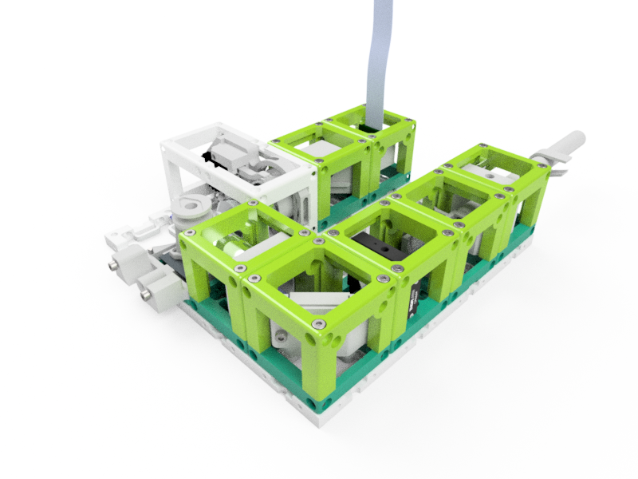

# Lightsheet Setup (Workshop)
This is the manual for the Lightsheet Microscope used for the International Day of Light (IDoL) workshop. 

The stl-files can be found in the folder [STL](./STL).

### Purpose
Produce 3D images with better sectioning.

## Properties
* design is derived from the base-cube

## Parts

### 3D printing parts 
* Please find all parts inside the folder [STL](./STL)
### Additional parts
* Please have a look at the bill of materials  

## Remarks and Tips 
### 3D Printing:
* No support required in all designs 
* Carefully remove all support structures (if applicable)

## Assembly and Alignment of the optical path
Here we briefly give a step-by-step tutorial on how-to allign the beam-path.

The illumination path is independent from the detection path - the order how you align it is up to you. 

## Assemble the illumination path (lightsheet)
Here we try to form the lightsheet.

#### 1. Mount the pre-assembled laser cube
* Place a white screen (e.g. paper) perpendicular to the laser (so that the beam-spot actually hits the screen) at a distance o	f 20cm behind the base plate
* Swith on the laser with the clamp
* Make sure the Laser is correctly centered 
* Place the cube on the lattice as indicated by the Animation below
* ATTENTION: !Don't hit your or anybody's eyes! 
* If you make a break or do something else than aligning at the moment, always switch off the laser to make sure you don't endanger anybody's eyesight!
	
#### 2. Align the telescope
* Place the pre-assembled telescope on the grid right after the laser
* Shift the iPhone lens inside the rail back and forth so that a parallel (i.e. collimated) beam is created
* This can be measured by simply comparing the beam at a distance of 2cm and 20 cm right after the telescope; The diameter should not change
* ATTENTION: !Don't hit your or anybodys eyes!

#### 3. Add the pre-mounted fold-mirror
* Place the pre-assembled 45° fold mirror on the grid after the telescope with one place-holder position
* ATTENTION: !Now the laser beam is going to a perpendicular direction to the one before. Make sure to block the light with i.e. a cardboard, so it can't leave you setup and hit somebody's eyes!

#### 4. Add the pre-mounted objective lens
* Place the pre-assembled 4x objective lens on the grid perpendicular to the fold mirror
* Tune the focus of the illumination so that it is in the center of the following block-position
* Tuning the objective lens can be done by shifting it back and forth in the spring-loaded spiral bearing
* Make sure the metal housing is removed from the objective by threading it appart (eventually apply some force; we need additional working distance) 

#### 5. Add the sample mount cube
* Place the pre-assembled sample mount cube on the grid right after the 4x objective lens 
* The motor must be pointing over the side of the baseplate 

#### 6. Add the cylindrical lens
* Place the pre-assembled lens-mount on the grid right after the telescope and before the fold-mirror
* Observe the focus inside the sample holder 
* The line-focus (i.e. lightsheet) should be in the center of the sample holder stage

## Assemble the detection path
Here we try to form the compound microscope.

#### 1. Mount the pre-assembled z-stage
* Place the Z-stage perpendicular to the illuminating light sheet (see figure below)

#### 2. Place the camera cube
* Place the camera cube right behind the filter cube
	
#### 3. Align the illumination path
* Place a sample (ideally a sheet of paper tilted 45° w.r.t. the lightsheet/imaging path) so that one sees speckle on the Raspberry Pi camera
* The paper can be mounted using the magnetic sample mount; fixed with some sticky tape
* The line-profile of the illuminating lightsheet should be roughly in the position of the focus of the objective lens 

#### 4. Align the imaging path
* The focus of the objective lens (therefore of the light-sheet) can be varied coarsely by shifting the lens back and forth in the spiral mount
* Take a torch and illuminate the sheet of paper from the position of the motor
* Move the paper along the z-focus so that one sees the structure of the paper on the raspi-camera (i.e. screen) 
* Once you see the pattern of the paper, align the lightsheet again
* Take a screwdriver and turn the screw of the tiltable/movable mirror - this mirror varies the angle of the lightsheet and the position where it hits the back focal plane of the 4x objective lens respectively 

* Move it so that you see the lightsheet in-focus with the bright-field image

#### 5. Use of filters
* When using a correct filter betweet the Z-stage and the camera, it's possible to observe a fluorescent image of the sample
* Here we omit the filter and therefore capture only the scattering image

The result could look like this:

##### Fluorescent Image (*Pollengrain in Agarose*)

##### Brightfield Image (*Pollengrain in Agarose*)

		
## Animation

## Safety
Don't touch the optical surfaces of lenses and objectives! 

Attention, don't cut your fingers while removing the lens from the iPhone sensor and the support material from 3D printed parts! 

Never (!) look into the laser pointer! It will damage your eye immediately!

* ATTENTION: NEVER LOOK DIRECTLY INTO THE LASER! EYE WILL BE DAMAGED DIRECTLY
* NEVER SWITCH ON THE LASER WITHOUT INTENDED USE 
* BEAM HAS TO GO AWAY FROM ONESELF - ALWAYS!