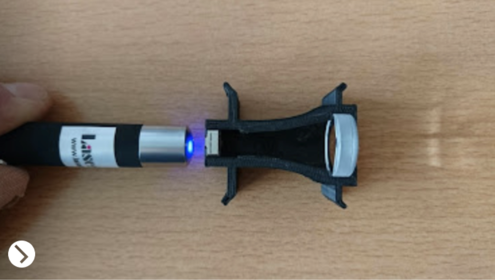
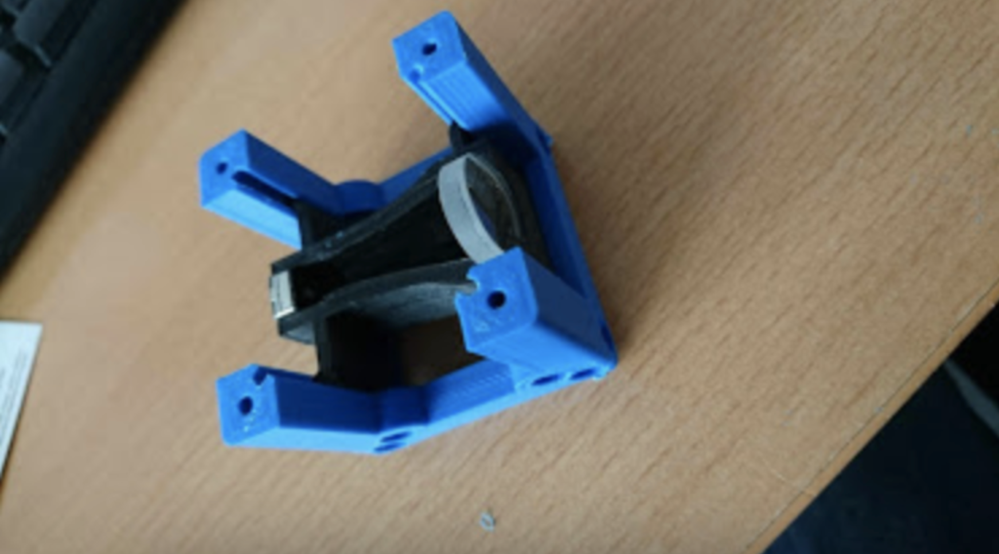
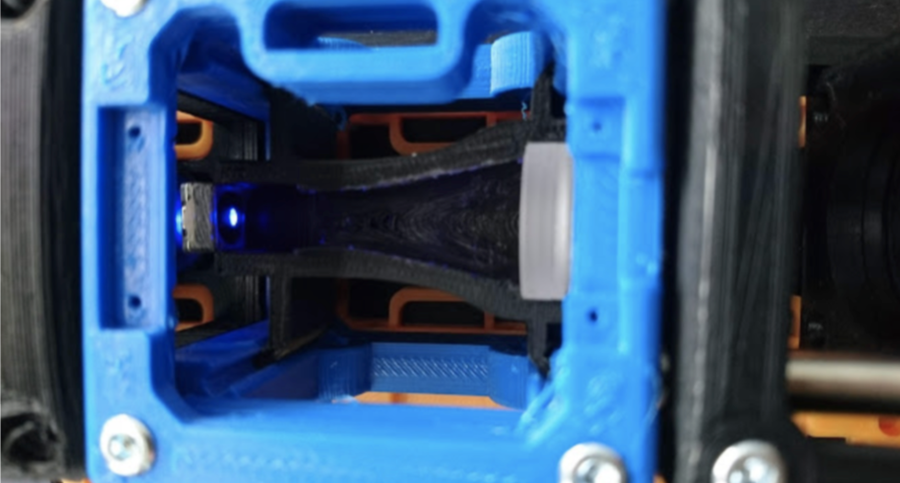

# Integrated Telescope/Beam-Expander Cube
This is the repository for the Integrated Telescope Cube.

The stl-files can be found in the folder [STL](./STL).

### Purpose
It adapts a very small beam-expander to the UC2 system.

Sometimes one need to increase the diameter of an illuminating beam. This is necessary for the Light-sheet microscopy setup for example. Here we have a laser-pointer which comes with a relatively small beam-diamter of about 2mm. By using a telescope, this can be magnified by a factor of e.g. 8 which results in a beam-dimater of 16 mm. This is necerssary to overfill the aperture of the following illumination objective lens.

In order to achieve this, we first need to focus the beam with a low focal length lens (e.g. cellphone lens, f'=3mm) and then re-collimate the lens with a second lens with a larger focal length e.g. f'=25 mm.

We designed a telescope where an iPhone 5 lens and an ordinary 25mm lens can be inserted in an adpater, which finds its place inside an ordinary UC2-cube as visualized in the image above.

## Properties
* design is derived from the base-cube
* the adapter for the telescope can be adjusted for different magnifications and lenses
* the beam height can be adjusted by sliding the the telescope along the axis
* the degree of collimation can be adjusted beforehand  * very cost-effecient beam-exander at a fairly good quality as the cellphone lens is diffraction limited (overall costs ~15€)
* Magnification : m=f_tl/f_ep = 25/3 = 8.33

## Parts

### 3D printing parts
The Part consists of the following components.

* **The Lid** where the Arduino + Electronics finds its place ([LID](./STL/Assembly_Cube_prettytelescope_10_Lid_el_v0_1.stl))
* **The Cube** which will be screwed to the Lid. Here all the functions (i.e. Mirrors, LED's etc.) find their place ([BASE](./STL/Assembly_Cube_prettytelescope_10_Cube_v0_2.stl))
* **The Telescope** which holds the two lenses  adapts it to the base cube ([TELESCOPE](./STL/Assembly_Cube_prettytelescope_01_pretty_telescope_iphone_12.stl))

### Additional parts
* 4x DIN912 M3*12 screws (non stainless steel)
* iPhone 5 lens (serperated from an iPhone camera spare part), f'=3mm
* biconved/plan-convex lens, f'=25mm, diameter=20mm, thickness=4mm

## Remarks and Tips
### 3D Printing:
* No support required in all designs
* Carefully remove all support structures (if applicable)

## Assembly
* Remove the iPhone lens from the camera (a dedicated tutorial can be found in the [UC2 Tutorial-Section](/TUTORIAL).
* Insert the lenses inside the telescope adapter (orientation of the iPhone has to be the way, that the small aperture - hole - has to face the other bigger lens as indicated by the photo)

* Take the laser-pointer
* Point the laser towards the iPhone Lens
* Adjust the distance between the two lenses, so that the beam is collimated (=the beam diamter right after the telescope should not change over any distance)
* Put the telescope inside the cube by sliding it along the slides

* Add the lid to the cube and fix it with the 4 M3 screws
* Done!

###Tutorial with images
Don't insert batteries in the laser yet!!

1. All parts for this model

1. Mount the first lens

1. Mount the cellphone lens

1. Fix the cellphone lens with blutek

1. Insert the telescope into the cube

1. Insert the telescope into the cube II

1. Assemble the cube with screws

1. Assembled:

#### Finetune the lens-distance (collimate the beam)

1. Add the centered laser to the grid like so:

1. Turn on the laser:

1. Optional: Align the laser (center with the screws)

1. Check the beam on a white piece of paper

1. Mark the position and diamter of the beam on the white piece of paper

1. Compare distance and diameter of laser spot at a distance far away

1. Adjust the position of the cellphone lens in the rail so that both spots have the same position and diameter (iterate - start at step 5 - until you're satisfied)

## Safety
Attention, don't cut your fingers while removing the lens from the iPhone sensor!

Never (!) look into the laser pointer! It will damage your eye immediately!

* ATTENTION: NEVER WATCH DIRECTLY INTO THE LASER! EYE WILL BE DAMAGED DIRECTLY
* NEVER SWITCH ON THE LASER WITHOUT INTEDED USE
* BEAM HAS TO GO AWAY FROM ONESELF - ALWAYS!
