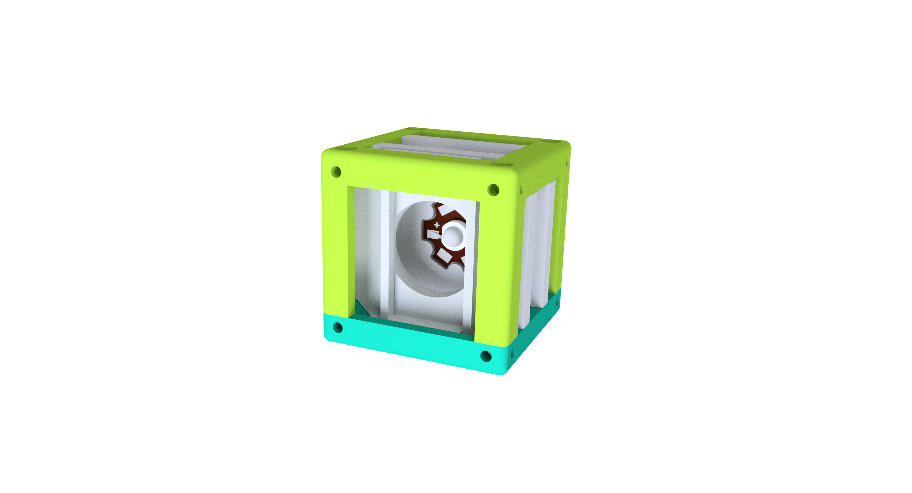

# LED Cube (+ Pinhole)
This is the repository for the design of the LED Cube. The stl-files can be found in the folder [STL](./STL).

## Purpose
This cube holds a single LED. Optionally, A generic sample holder can be added to hold a pinhole directly in front of the LED.

## Properties
* design is derived from the Base Cube

## Parts

### 3D printing parts
Here we list the 3D printed components from the [STL](./STL) folder

The Part consists of the following components.

1. **The Base** where the ball magnets will be fed in
2. **The Lid** where the Arduino + Electronics finds its place
3. **The Cube** which will be screwed to the Lid. Here all the functions (i.e. Mirrors, LED's etc.) find their place
4. **The LED holder Insert** that holds the LED
5. **The Sample holder Insert** that can hold the pinhole in front of the LED
6. **The Sample holder clamp** that fixes the pinhole in its position

### Additional parts
* Hi-Power LED 1W/3W UV STAR Ultraviolet for the Holography experiment
* Any LED STAR if you plan to use it for another application

## Remarks and Tips

### 3D Printing
* No support required in all designs
* Carefully remove all support structures (if applicable)

## Assembly
* Remove any support and clean the part
* Solder the wires to the LED
* Insert the LED in its holder
* Slide the LED holder into the Cube Body
* Press the Clamp on the sample holder, slide the holder into the Cube Body in front of the LED
* Add the lid and fix it using a set of M3 screws
* Don't forget to fix the wires of the LED to the screw in the Lid!
* Done!
