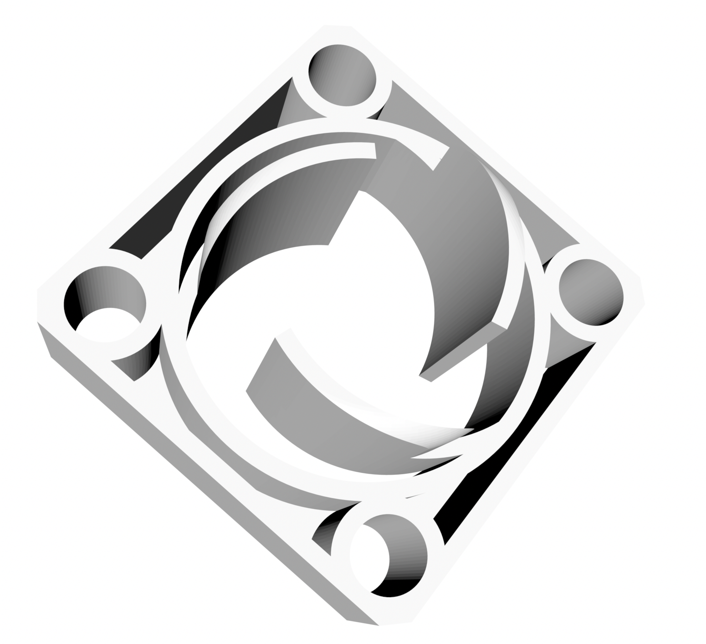

# Objective/Lensholder Cube
This is the repository for the Objective/Lensholder Cube. 

The stl-files can be found in the folder [STL](./STL).

### Purpose
It adapts a RMS-threaded objecitve lens or any lens with a diamter of ~18-25 mm to the UC2 system.

The Objective lens images the light-sheet created with the cylindrical lens. This means, that its size can be decreased, thus being beneficial for the optical sectioning of the device. According to the formula d=lambda/sin(alpha)=lambda/NA, where lambda corresponds to the center wavelength of the illuminating rays and NA=sin(a) is given by the opening angle of the imaging lens, the minimal diameter d of a spot inside the focus of the lens is smaller, the smaller the NA of the lens is. Here we use a lens with an opening aperture of NA=0.1 which generates a thinner lightsheet, thus allowing better sectioning. 

## Properties
* design is derived from the base-cube
* the adapter can hold a large variety of different lenses (differnt diameters/threads)
* the spiral automatically centers the lens to the optical axis 
* the here used objective lens has the following parameters:
	* Thread: RMS
	* Magnification: 4x 
	* NA: 0.1
	* Finite Corrected Optics

## Parts

### 3D printing parts 
The Part consists of the following components. 

* **The Lid** where the Arduino + Electronics finds its place ([LID](./STL/Assembly_Cube_Objectiveholder_10_Lid_el_v0_1.stl))
* **The Cube** which will be screwed to the Lid. Here all the functions (i.e. Mirrors, LED's etc.) find their place ([BASE](./STL/Assembly_Cube_Objectiveholder_10_Cube_v0_2.stl))
* **The Objective/Lens Holder** which holds a lens with varying dimater and adapts it to the base cube ([LENSHOLDER](./STL/Assembly_Cube_Objectiveholder_11_Cube_Adapter_RMS_lens_2.stl))

### Additional parts 
* 4x DIN912 M3*12 screws (non stainless steel)
* Microscopic Objective lens, 4x, 0.1NA, RMS-Thread, Finite corrected
* 2x Rods, 50*6mm, steel/allimimium

## Remarks and Tips 
### 3D Printing:
* No support required in all designs 
* Carefully remove all support structures (if applicable)

## Assembly
* Unscrew the cap of the objective lens
* Widen the 4 holes of the RMS adapter, so that it fits on the rods using a 4mm drilling tool (not too loose, not too stiff)
* Insert the 4x objective lens into the RMS-Adapter
* Insert the rods on one side of the cube
* Put the lensm mount adapter inside the cube and mount it on the rods by sliding the rods throught the holes 
* Add the lid to the cube and fix it with the 4 M3 screws
* Done!

## Safety
Attention, don't cut your fingers while removing the lens from the iPhone sensor! 

Never (!) look into the laser pointer! It will damage your eye immediately!

* ATTENTION: NEVER WATCH DIRECTLY INTO THE LASER! EYE WILL BE DAMAGED DIRECTLY
* NEVER SWITCH ON THE LASER WITHOUT INTEDED USE 
* BEAM HAS TO GO AWAY FROM ONESELF - ALWAYS!
