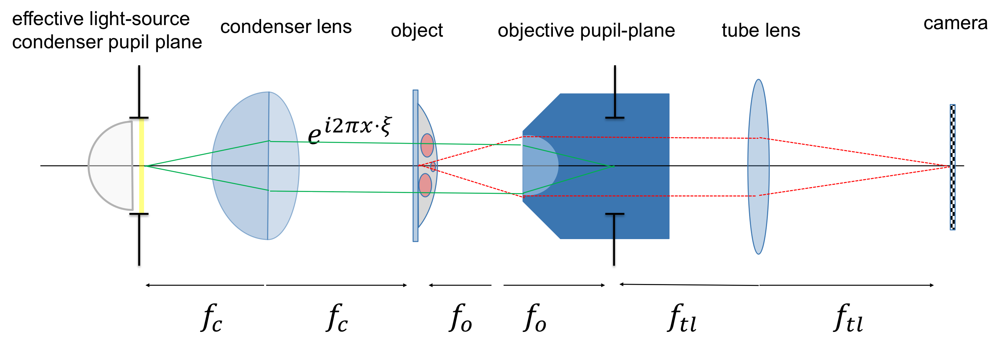
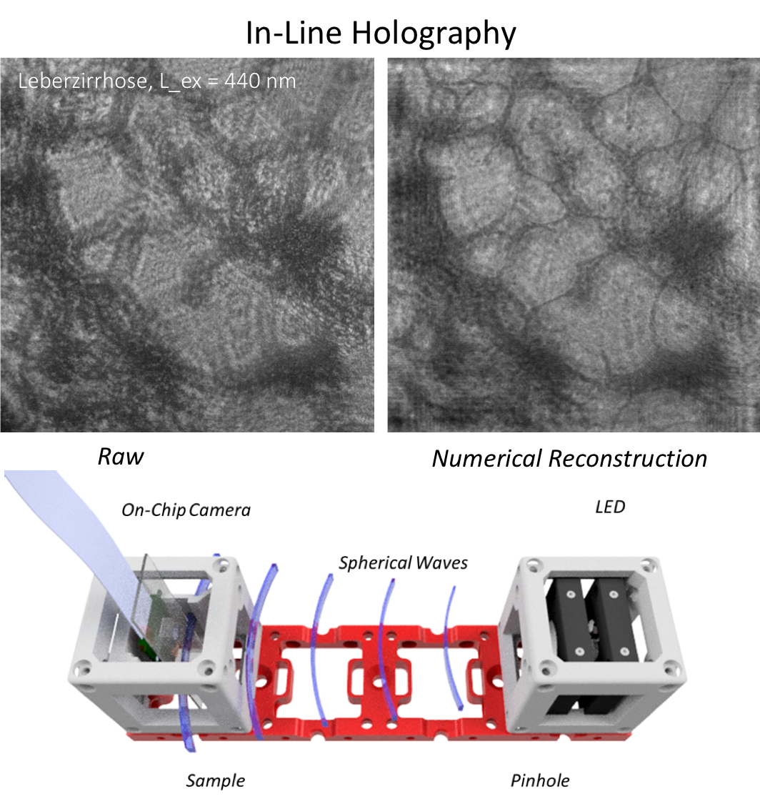

# UC2

This is the online repository for the open-source hardware project ''UC2'' [YouSeeToo]. 

## Introduction

**UC2** is a general-purpose modular framework for making interactive (electro)-optical projects. Most optical systems out there follow a simple so called **4f** setup, where optical lenses are aligned such that focal-planes of adjacent components overlap to limit the amount of aberrations as much as possible and to be able to predict the system-behavior easily using e.g. Fourier-imaging theory. 

Therefore the simplest microscope could be realized using only 2 lenses. Their angular magnification is characterized by the ratio of the objective f_obj and tube lens f_tube

$M_4f=  f_obj/f_tube 	(1)$.<!---->

**U2C** not only modularizes the optical components in a setup, but allows to make each individual block, represented by a specifc function (i.e. lens, mirror, xy-stage, etc.), ''smart''. Therefore a small microcontroller (i.e. Arduino Nano) connects to a **I^2** BUS, making it possible to communicate with a Master-device (i.e. Raspberry Pi). Illumination sources like LED-Matrices, Motors, etc. can be controlled, sensors like light- or humidity sensors can be readout. 

It aims to bring 21st-century concepts of clean abstraction and modularity to hardware design.

**UC2** is in active development. It is ment to be used not only by beginners, but also for professionals dealing with optical setups on a daily basis. Its click-and-go concept simplifies the process of aligning and adjusting the parts giving new tools acting as rapid-prototyping devices. It also comes with a series of open-source workshops (in the future) explaining the theory behind optics. 

People are also encouraged to share their work. We are curious what the community is doing with our little blocks. All necessary details to modify the design of the blocks are given in the sub-folders of the specific folders. 

## List of available Setups

Our goal is to make as many setups as possible available, so that people can play with it. Basically everything's possible, you just need to think in blocks! Please go to the [CAD](./CAD/Readme.md)-folder to have a glimpse of what'S possible

* Light-sheet Microscope
* In-Incubator Microscope with X/Y/Z-control and adaptive illumination 
* Telescope
* Smartphone Microscope
* Abbe Experiment (Diffraction-effect of light)
* Michelson interferometer (Interference-effect of light)

## Bill of Material

All the parts are from typical distributors like Amazon, Alibaba, Ebay, etc. to provide an easy-to-build solution not relying on special components. The project is heavily benefitting from the wide variety and availability of components brought up by the open-source community 

## Getting Started

## Structure of Repository
**HARDWARE**
	
	* ARDUINO
		* Programming files for the I2C Bus 
		* I2C Documentation 
	* CAD
		* LIGHTSHEET
		* Abbe Experiment
		* In-Incubator Microscope
		* etc. (all come with:)
			* STL
			* INVENTOR
	* DATASHEETS
	* DOCUMENTS
		*  Useful Documents for building the projects
		*  Bill of Materials 
	* Electronics
		* Schematics 
		* Tips and Tricks
	* RASPBERRY-Pi
		* Programming Files for The Pi
		* Python Helper Files
	* WORKSHOPS
		* A growing list of available resource files for workshops (meant for hackathons, universities, schools, etc.) 
		* Manuals
		* Projects 
	* LICENSE
		* Agreement
		* PLEASE READ!

## Get Involved!
This project is open so that anyone can get involved. Ways you can contribute include (see also: https://github.com/rwb27/openflexure_microscope):

* Get involved in discussions in the ISSUE-section
* Raise an issue if you spot something that's wrong, or something that could be improved. This includes the instructions/documentation.
* We support you with the basic CAD Design files, so that you can develop specific hardware-function which can fit in our cubes (Autocad Inventor files are not accessible though) 
* Suggest better text or images for the instructions.
* Improve the design of parts - even if you don't use OpenSCAD, STL files or descriptions of changes are helpful.
* Fork it, and make pull requests - again, documentation improvements are every bit as useful as revised OpenSCAD files.
* Things in need of attention are currently described in issues so have a look there if you'd like to work on something but aren't sure what.

REMARK: All files have been designed using Autodesk Inventor 2019 (EDUCATION)
### Start Designing individual parts 
We compiled a quick tutorial where you find a guide on how an inlet could look like. The base-cubes can hold any function you want. The fastes way is to rely on Thorlabs parts, but basically any other part can fit in it too. Have a look here:
[Guide to design a customized function](./DOCUMENTS/Basic_Design_Cube_Inlet_Function_v0.pdf)

## Raspberry Pi Quick-Start 
Please find a manual here

## Kits, License and Collaboration
This project is open-source and is released under the CERN open hardware license. Our aim is to make the kits commercially available. 
We encourage everyone who is using our Toolbox to share their results and ideas, so that the Toolbox keeps improving. It should serve as a easy-to-use and easy-to-access general purpose building block solution for the area of STEAM education. All the design files are general for free, but we would like to hear how it is going. 

You're free to fork the project and enhance it. If you have any suggestions to improve it or add any additional functions make a pull-request or file an issue. 

Please find the type of licenses [here](./License.md)

## Printing it yourself
All the CAD-Parts can be printed using an off-the-shef 3D printer (or 3D printing service). Currently we use majorly PLA and ABS coming from an ULTIMAKER 2+/3 (Netherlands) or DeeGreen (Czech Republic). 

Each project has a specific sub-folder in the CAD-section where all necessary .stl files are lying ready for printing. Instructions will be added soon. 

Don't just print everything from the STL folder, as currently it contains some parts that must be printed multiple times, and other parts that are redundant. 

## Showcase
This is one of the very first prototypes we had in 2017. It has evovled a lot.

